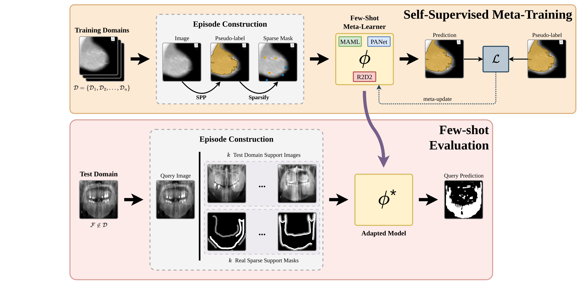
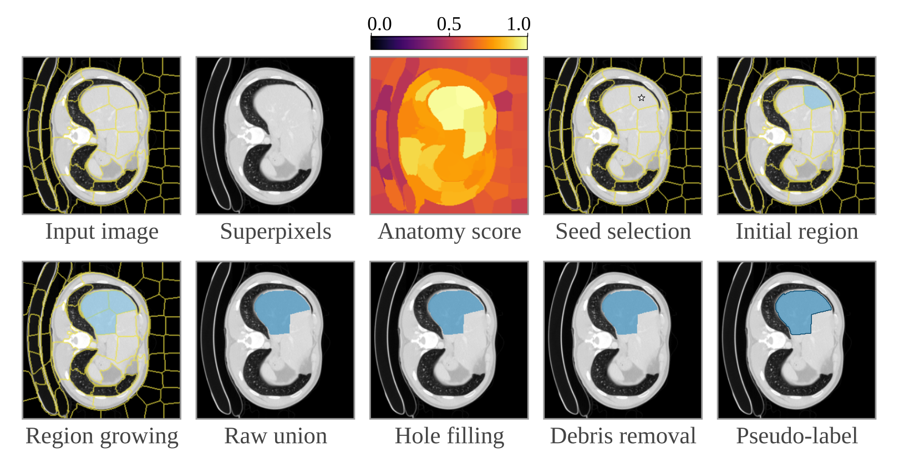
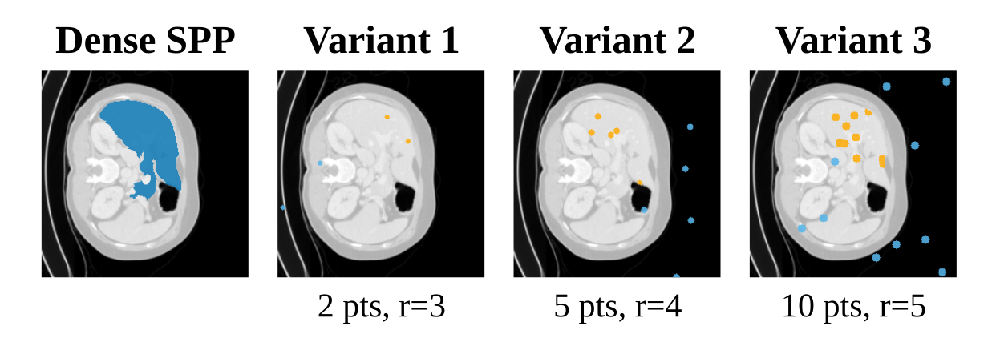
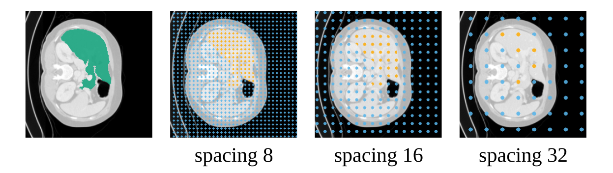
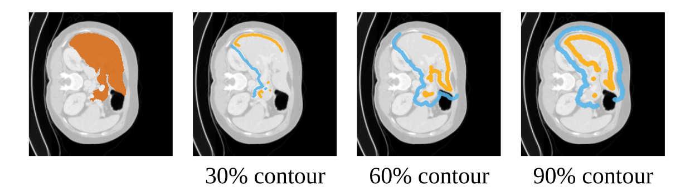
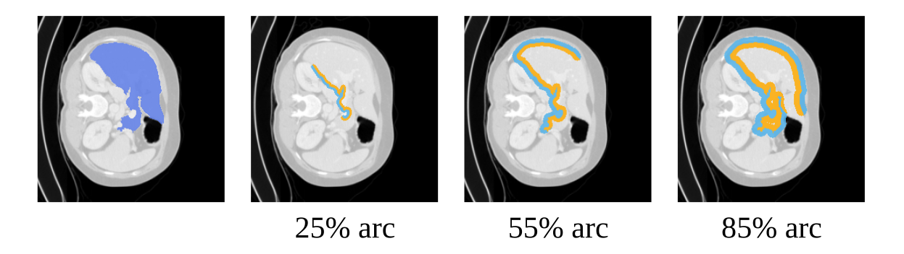
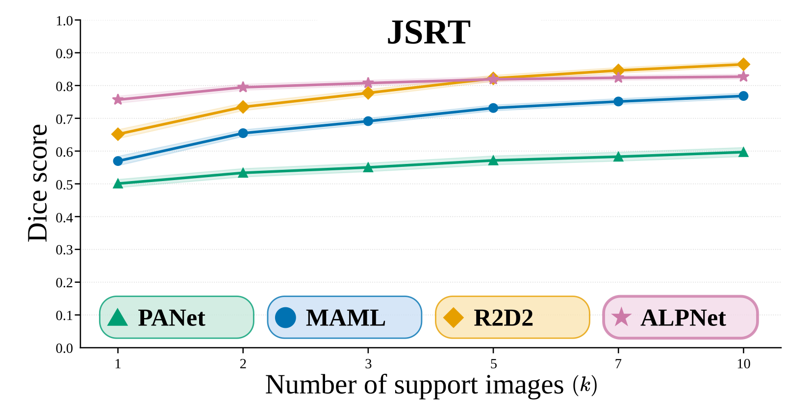
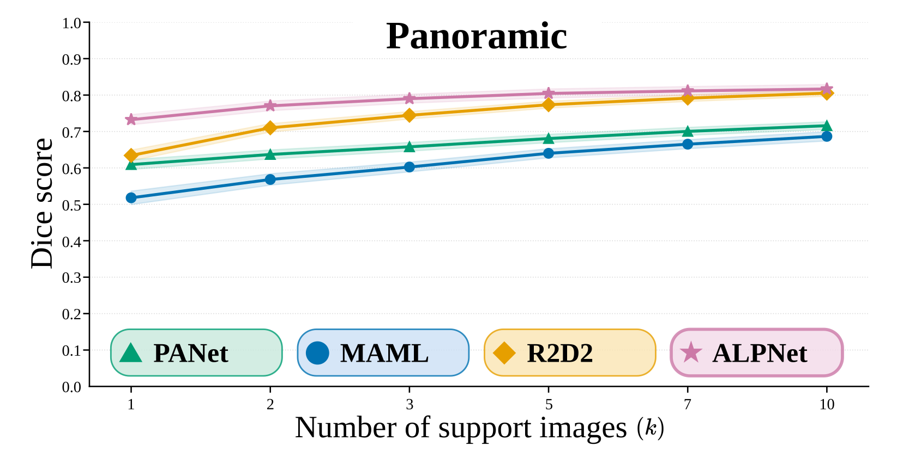

# Self-Supervised Meta-Learning from Sparse Labels for Few-Shot Medical Image Segmentation


Official implementation of **"Self-Supervised Meta-Learning from Sparse Labels for Few-Shot Medical
Image Segmentation"** — Danilo F. Vieira, José Roberto Martins-Costa, Daniel L. Fernandes,
Hugo N. Oliveira and Marcos H. F. Ribeiro (Universidade Federal de Viçosa).

**Paper:** *link to be added* <!-- TODO(author): add paper URL (and update the Paper badge) -->

This repository lets you meta-train a few-shot segmentation model **without using ground-truth masks as
training supervision**.
Training supervision comes from pseudo-labels generated automatically from unlabelled images with a
superpixel heuristic; those pseudo-labels are then sparsified into points, grid samples, scribbles or
partial contours to imitate cheap human annotation. At test time, the model adapts to a new anatomical
structure in an unseen imaging modality from only *k* sparsely annotated support images.



### What this repository provides

| Method | Role in the paper | Support annotation at test time | Original work | Reference code |
|---|---|---|---|---|
| **MAML / MetaSGD** | meta-learner (gradient-based) | sparse | Finn et al., ICML 2017; Li et al., 2017 | [cbfinn/maml](https://github.com/cbfinn/maml), via [learn2learn](https://github.com/learnables/learn2learn) |
| **PANet** | meta-learner (prototype-based) | sparse | Wang et al., ICCV 2019 | [kaixin96/PANet](https://github.com/kaixin96/PANet) |
| **R2D2** | meta-learner (closed-form ridge regression) | sparse | Bertinetto et al., ICLR 2019 | [bertinetto/r2d2](https://github.com/bertinetto/r2d2) |
| **ALPNet** | baseline | **dense** | Ouyang et al., ECCV 2020 | [cheng-01037/Self-supervised-Fewshot-Medical-Image-Segmentation](https://github.com/cheng-01037/Self-supervised-Fewshot-Medical-Image-Segmentation) |

All four methods use the same preprocessed data, the same evaluation episodes and the same evaluation
script, so their results are directly comparable.

---

## Contents

1. [How the framework works](#1-how-the-framework-works)
2. [Requirements](#2-requirements)
3. [Installation](#3-installation)
4. [Preparing the datasets](#4-preparing-the-datasets)
5. [Generating the episode manifests](#5-generating-the-episode-manifests)
6. [Training](#6-training)
7. [Evaluation](#7-evaluation)
8. [Extending the framework](#8-extending-the-framework)
9. [Repository layout](#9-repository-layout)
10. [Acknowledgements and third-party code](#10-acknowledgements-and-third-party-code)
11. [Citation](#11-citation)
12. [License](#12-license)

---

## 1. How the framework works

The pipeline has five stages. Each stage is one script, and each script reads the output of the previous one.

```
data/raw/            ──prepare_data.py──▶  data/processed/*.npy          (2D slices, splits)
data/processed/*.npy ──generate_episodes.py──▶ data/processed/episodes_*.npz (fixed evaluation episodes)
                     ──train.py / train_alpnet.py──▶ checkpoints/pseudo/*.pt
checkpoints + episodes ──study_shots.py──▶ results/pseudo/<method>/shots/<dataset>/results.csv
results.csv files    ──shots_table.py / plot_shots.py──▶ results/pseudo/tables/, results/pseudo/figures/
```

**Pseudo-labels.** For each training slice, one of three superpixel algorithms (SLIC,
Felzenszwalb–Huttenlocher or Watershed) is chosen at random. Every region is scored by how bright,
compact and far from the image border it is; a seed region is sampled among the four best, grown by
up to two neighbours, and cleaned. The result is a binary mask that plausibly covers an anatomical
structure. It is computed once and cached on disk. Code: [`sslfss/data/propose_msk.py`](sslfss/data/propose_msk.py).



**Sparsification.** A dense mask is turned into a ternary mask with values `1` (foreground),
`0` (background) and `-1` (unlabelled). Unlabelled pixels are ignored by the loss. Four modes are
available and one is drawn uniformly at random each time. Code: [`sslfss/data/sparsify.py`](sslfss/data/sparsify.py).

| Points | Grid | Scribbles | Partial contour |
|:---:|:---:|:---:|:---:|
|  |  |  |  |

**Training episodes.** Pseudo-labels are generated independently per image, so two different images
never share a class that the model could learn to transfer. Each training episode is therefore built
from a single slice: the *support* is the slice with its sparse pseudo-label, the *query* is the same
slice with its dense pseudo-label, and both receive the same random flip/rotation. The model learns to
turn a sparse annotation into a dense segmentation.

**Evaluation episodes.** At test time the setting is the usual few-shot one: a query image from an
unseen dataset, *k* different support images from the same dataset, and support masks derived from
real annotations (sparse for MAML, PANet and R2D2; dense for ALPNet).

---

## 2. Requirements

| | Tested configuration |
|---|---|
| OS | Ubuntu 24.04 |
| Python | 3.10 |
| PyTorch | 2.5.1 (CUDA 12.1) |
| GPU | NVIDIA RTX 3050, 6 GB VRAM — all experiments of the paper fit in this budget |
| RAM | 16 GB (preprocessing streams one volume at a time) |

A GPU is strongly recommended.

**Disk space** for the full set of datasets used in the paper:

| Item | Size |
|---|---|
| `data/raw/` (datasets in the accepted format) | ≈ 18 GB |
| `data/processed/` slice arrays | ≈ 50 GB |
| Pseudo-label caches (`pseudo_cache_*.npz`) | ≈ 7.3 GB |
| ALPNet superpixel caches (`alpnet_superpix_cache_*.npz`) | ≈ 18 GB |
| Episode manifests | ≈ 0.2 GB |
| Checkpoints written by training (all four methods) | ≈ 0.5 GB |

---

## 3. Installation

```bash
git clone https://github.com/danilo1917/SIBGRAPI2026-ssl-sparse-fss.git
cd SIBGRAPI2026-ssl-sparse-fss

python3.10 -m venv env
source env/bin/activate
pip install --upgrade pip
pip install -r requirements.txt
```

`requirements.txt` does not pin versions. For an exact match with the paper, install PyTorch 2.5.1 and
torchvision 0.20.1 for your CUDA version first (see [pytorch.org](https://pytorch.org/get-started/previous-versions/)),
then the requirements. The versions used to produce the reported results were:

```
torch 2.5.1   torchvision 0.20.1   monai 1.5.2   learn2learn 0.2.0   numpy 2.2.6
scipy 1.15.3  scikit-image 0.25.2  scikit-learn 1.7.2   pandas 2.3.3   nibabel 5.4.2
Pillow 12.2.0 opencv-python-headless 4.13.0   matplotlib 3.10.8
```

Check the installation:

```bash
python -c "from sslfss.methods import get_method; [get_method(m) for m in ('maml','panet','r2d2','alpnet')]; print('ok')"
```

All commands in this guide are run **from the repository root**. Every script adds the root to
`sys.path` itself, so no `pip install -e .` is needed.

### Running the full pipeline

With the datasets in place ([Section 4](#4-preparing-the-datasets)), the experiment of the paper is
reproduced with:

```bash
python scripts/prepare_data.py
python scripts/generate_episodes.py --seed 42 --n_trials 5 --k_eval 5 --k_max 10

for M in maml panet r2d2; do python scripts/train.py --method "$M"; done
python scripts/train_alpnet.py

for M in maml panet r2d2 alpnet; do
  python scripts/study_shots.py --method "$M" \
    --episodes data/processed/episodes_shots_s42_k10_t5.npz --k_values 1 2 3 5 7 10
done

python scripts/shots_table.py
python scripts/plot_shots.py
```

Sections 4 to 7 explain each step, its outputs and its options.

---

## 4. Preparing the datasets

The datasets are **not** included in this repository: most of them require registration or a
data-use agreement with their owners. This section explains exactly what format the code accepts, then
lists the datasets used in the paper and where to obtain them.

### 4.1 The accepted input format

Place each dataset in its own folder under `data/raw/train/` (used for meta-training) or
`data/raw/test/` (used only for few-shot evaluation):

```
data/raw/
├── train/
│   ├── <dataset_a>/
│   │   ├── imagesTr/        images
│   │   ├── labelsTr/        masks, one per image
│   │   └── imagesTs/        (optional) unlabelled NIfTI volumes, see below
│   └── <dataset_b>/ ...
└── test/
    └── <dataset_c>/
        ├── imagesTr/
        └── labelsTr/
```

`prepare_data.py` discovers every sub-folder that contains `imagesTr/`. Dataset names are not
hard-coded: the folder name becomes the dataset name everywhere downstream (file names, result
directories, CSVs). Use short names without spaces.

**Two file formats are accepted.** The format is detected per dataset from the files found in
`imagesTr/`.

| | NIfTI volumes (`.nii.gz`) | 2D images (`.png`) |
|---|---|---|
| Typical use | CT, MRI | X-ray, mammography, pre-sliced volumes |
| How images and masks are paired | by **sorted file order** — give the image and its mask the same file name | by **identical file name** (stem) in `imagesTr/` and `labelsTr/`; images without a mask are skipped |
| Foreground | any label value `> 0` | pixel value `> 127` (store masks as 0 / 255) |
| Multi-class masks | all non-zero labels are merged into one foreground | only values above 127 count as foreground |
| Colour | — | RGB images are converted to grayscale |
| 2D extraction | volume sliced along array axis `slice_axis` (default `2`) | each file is one slice |

**Rules that affect your results.** Read these before converting a dataset.

1. **Volume-level split for PNG datasets depends on file names.** Training datasets are split 80/20 into
   training and validation *by volume*, so that slices of the same patient never end up on both sides. For
   NIfTI, one file is one volume. For PNG, the volume is inferred from the file name: everything before
   the last underscore. `patient07_slice031.png` and `patient07_slice032.png` belong to volume
   `patient07`. A file name **without an underscore is treated as its own volume**, which silently turns
   the split into a slice-level split. If your PNG files are slices of 3D scans, name them
   `<volume>_<slice>.png`.
2. **Slices with almost no foreground are discarded.** A slice is kept only if its mask covers at least
   `min_fg_fraction = 0.1 %` of the pixels. This removes the empty slices at the ends of a volume. For
   training datasets, this filter is the **only** place where the ground-truth masks are read — they never
   supervise the model. They are still required, because they decide which slices are kept.
3. **Check the slicing axis of your NIfTI files.** Slices are taken along the third axis of the array as
   stored on disk. If your volumes are oriented differently, reorient them before placing them in
   `imagesTr/`, or change `slice_axis` in `config.py` (this affects every NIfTI dataset).
4. **Unlabelled data can be added to training.** NIfTI volumes placed in `imagesTs/` of a *training*
   dataset are sliced and appended to the training set. Only constant slices are skipped; the foreground
   filter of rule 2 does not apply, since these volumes have no masks. They are not used for validation.
5. **Test datasets are not split.** Every kept slice is used both as a query and as a candidate
   support image. Supports are drawn from any other slice of the same dataset, which for a 3D test set
   includes neighbouring slices of the same patient. The test sets of the paper are 2D.

**Preprocessing applied by the code** (you do not need to do this yourself): intensity clipping to the
1st–99th percentile (per volume for NIfTI, per image for PNG), min–max scaling of each slice to [0, 1],
resizing to 256 × 256 (bilinear for images, nearest-neighbour for masks) and per-slice z-score
normalisation at model input.

### 4.2 Datasets used in the paper

Six datasets are used for meta-training and two, from imaging modalities never seen during training,
for evaluation. Several of them were converted from their original distribution format into the layout of
[Section 4.1](#41-the-accepted-input-format); that conversion is not part of this repository.

| Folder name | Dataset | Role | Modality | Foreground | Source | Citation |
|---|---|---|---|---|---|---|
| `brats` | BraTS 2020 | train | MRI | whole tumour | [CBICA](https://www.med.upenn.edu/cbica/brats2020/data.html) | Menze et al. 2015; Bakas et al. 2017; Bakas et al. 2018 |
| `chaos_ct` | CHAOS (CT) | train | CT | liver | [Zenodo](https://zenodo.org/records/3431873) | Kavur et al. 2021 |
| `hc_pediatric_cerebellum_highresnet` | HC Pediatric Cerebellum | train | MRI | cerebellum | private | — |
| `lits` | LiTS | train | CT | liver tumour | [CodaLab](https://competitions.codalab.org/competitions/17094) | Bilic et al. 2023 |
| `mias` | MIAS | train | mammography | breast | [Apollo, University of Cambridge](https://doi.org/10.17863/CAM.105113) | Suckling et al. 2015 |
| `multiorgan_ct_btcv` | BTCV | train | CT | abdominal organs | [Synapse](https://www.synapse.org/Synapse:syn3193805) | Landman et al. 2015 |
| `jsrt` | JSRT, with SCR lung masks | test | chest X-ray | lungs | [JSRT](http://db.jsrt.or.jp/eng.php), [SCR](https://zenodo.org/records/7056076) | Shiraishi et al. 2000; van Ginneken et al. 2006 |
| `panoramic` | Panoramic Dental X-rays | test | panoramic X-ray | mandible | [Mendeley Data](https://data.mendeley.com/datasets/hxt48yk462/2) | Abdi et al. 2015 |

Each dataset is subject to its own terms of use. HC Pediatric Cerebellum is private; the framework runs with
any subset of the training datasets. BibTeX entries are in [Section 11](#11-citation).

### 4.3 Running the preprocessing

```bash
python scripts/prepare_data.py
```

For each discovered dataset the script prints its role and format, counts the valid slices, writes them
to disk and, for training datasets, performs the volume-level split:

```
── Dataset: chaos_ct  (role=train)
   format : nifti
   Counting labelled slices... 2318
   Writing 2318 slices (256×256) to disk (memmap)...
   images : (2318, 256, 256)  |  masks : same
   Split — treino: 1872 slices (16 labelled vols + 0 Ts) | val: 446 slices (4 vols)
   Saved to: .../data/processed
```

Slices are streamed straight into memory-mapped arrays, so peak RAM is about one volume. The output
in `data/processed/` is:

| File | Content |
|---|---|
| `<name>_imgs.npy` | `float32 (N, 256, 256)` image slices in [0, 1] |
| `<name>_msks_reais.npy` | `float32 (N, 256, 256)` binary ground-truth masks |
| `<name>_vol_ids.npy` | `int64 (N,)` volume index of each slice |
| `<name>_role.txt` | `train` or `test` |
| `<name>_idx_treino.npy`, `<name>_idx_val.npy` | slice indices of the training and validation splits (training datasets) |
| `<name>_idx_all.npy` | all slice indices (test datasets) |

Re-running the script rebuilds these arrays but does not delete the caches and manifests built from them.
After changing the set of datasets, delete `data/processed/pseudo_cache_*.npz`,
`data/processed/alpnet_superpix_cache_*.npz` and `data/processed/episodes_*.npz`, then regenerate the manifests.

### 4.4 Adding your own dataset

1. Choose the role: `train` (unlabelled use, masks only filter slices) or `test` (masks define the task).
2. Convert it to PNG or NIfTI following [Section 4.1](#41-the-accepted-input-format) — in particular the
   foreground rule of your format and, for PNG slices of 3D scans, the `<volume>_<slice>.png` naming.
3. Place it in `data/raw/train/<name>/` or `data/raw/test/<name>/`.
4. Re-run `prepare_data.py`, delete the stale caches and manifests, and regenerate the manifests.

---

## 5. Generating the episode manifests

Few-shot results depend strongly on which support images are drawn. To compare methods fairly, all
evaluation episodes are sampled **once**, with a fixed seed, and stored in `.npz` manifests that every
method reads. Two methods evaluated on the same manifest see identical query images, identical support
images and identical sparse support masks.

```bash
python scripts/generate_episodes.py --seed 42 --n_trials 5 --k_eval 5 --k_max 10
```

| Argument | Default | Meaning |
|---|---|---|
| `--seed` | 42 | seed for all evaluation manifests |
| `--n_trials` | 5 | independent support sets drawn per query image |
| `--k_eval` | 5 | support-set size of the fixed-*k* manifests |
| `--k_max` | 10 | support-set size of the shots manifest (largest *k* you will evaluate) |
| `--val-seed` | 123 (`config.val_seed`) | seed of the validation manifest |
| `--k_val` | 5 (`config.k_shot`) | support-set size of the validation manifest |

Files written to `data/processed/`:

| Manifest | Used by | Contents |
|---|---|---|
| `episodes_shots_s42_k10_t5.npz` | `study_shots.py` — **the paper's experiment** | for each test query and trial: 10 support indices and their sparse masks |
| `episodes_val_s123_k5.npz` | `train.py` (validation) | validation episodes built from the training datasets' validation split, with real masks |
| `episodes_eval_…`, `episodes_steps_…`, `episodes_sparsification_…` | not used in this repository | written by the same script for additional studies |

The shots manifest uses **nested support sets**: for each query and trial, 10 supports are drawn once and
the first *k* are used for a given *k*. The support set for *k* = 3 is therefore contained in the one for
*k* = 5, and the curve over *k* measures the effect of adding supports rather than of drawing new ones.

Existing manifests are **skipped**, not overwritten. The evaluation manifests are drawn from one random
stream in a fixed order (eval, shots, sparsification, steps), so regenerating a single manifest does not
reproduce its original episodes. To regenerate, delete all `episodes_*.npz` files and run the script again.

---

## 6. Training

Training needs the preprocessed training datasets **and** the validation manifest from Section 5.

### 6.1 MAML, PANet and R2D2

```bash
python scripts/train.py --method maml
python scripts/train.py --method panet
python scripts/train.py --method r2d2
```

What happens when you run it:

1. **Loading.** The training and validation splits of every training dataset are memory-mapped.
2. **Pseudo-labels.** On the first run, a pseudo-label is computed for every training slice and saved to
   `data/processed/pseudo_cache_treino_seed42.npz`. This is the slowest step and is done once; later runs
   and the other methods reuse the cache. Slices whose pseudo-label is empty are excluded from training.
3. **Episodes.** Training datasets are sampled with probability proportional to the square root of their
   size, so large datasets do not dominate. Each episode is a single-slice support/query pair (Section 1).
4. **Optimisation.** 36 000 episodes in meta-batches of 4, i.e. 9 000 steps, with cosine learning-rate decay.
5. **Validation.** Every 500 steps on a fixed subset of 200 validation episodes, and on all validation
   episodes after every `training slices / 4` steps. With the datasets of the paper that interval is longer
   than the 9 000 training steps, so the best checkpoint is selected on the 200-episode subset. Validation
   uses real masks for model selection only; they are never used as supervision.
6. **Checkpoints.** `checkpoints/pseudo/sslfss_<method>.pt` holds the best validation Dice;
   `sslfss_<method>_last.pt` is rewritten at every validation.
7. **Curves.** At the end, `results/pseudo/training_curves.svg` is written. The file name does not include
   the method, so copy it before training the next method.

Training cannot be resumed from a checkpoint; an interrupted run starts over.

### 6.2 ALPNet (baseline)

ALPNet follows the protocol of its original release, which differs from the one above, so it has its own script:

```bash
python scripts/train_alpnet.py                  # 36 000 steps, COCO-initialised encoder
python scripts/train_alpnet.py --n_steps 50000  # longer run
python scripts/train_alpnet.py --no_coco_init   # encoder trained from scratch
```

Differences from Section 6.1:

- Pseudo-labels are ALPNet's own: one random Felzenszwalb superpixel per slice, cached per dataset in
  `data/processed/alpnet_superpix_cache_ds<i>.npz`.
- The encoder is a DeepLabV3-ResNet101 initialised from COCO; the weights are downloaded on first use.
- Seed 1234, batch size 1, SGD, and **no validation**, as in the reference implementation.
- Checkpoints are `sslfss_alpnet_step<N>.pt` every 25 000 steps and `sslfss_alpnet_last.pt` at the end. There
  is no "best" checkpoint. The loss history and curve go to `results/pseudo/sslfss_alpnet_historico.npz` and
  `sslfss_alpnet_loss.png`.

For evaluation, `study_shots.py` loads `sslfss_alpnet.pt` if it exists and otherwise falls back to
`sslfss_alpnet_last.pt`. To evaluate a specific step, copy or rename that checkpoint to `sslfss_alpnet.pt`.
The ALPNet results reported in the paper were obtained with the final checkpoint, `sslfss_alpnet_last.pt`.

### 6.3 Configuration reference

All paths and shared hyperparameters live in [`config.py`](config.py). Method-specific
hyperparameters are dataclasses at the top of each file in [`sslfss/methods/`](sslfss/methods/).
Change them in the file; there are no command-line overrides. Values below reproduce the paper.

| Setting | Value | Where |
|---|---|---|
| `train_datasets_dir`, `test_datasets_dir` | `data/raw/train`, `data/raw/test` | `config.py` |
| `processed_dir`, `checkpoints_dir`, `results_dir` | `data/processed`, `checkpoints`, `results` | `config.py` |
| `target_size` | `(256, 256)` | `config.py` |
| `slice_axis` | `2` | `config.py` |
| `min_fg_fraction` | `0.001` | `config.py` |
| `val_frac` | `0.20` | `config.py` |
| `seed` / `val_seed` | `42` / `123` | `config.py` |
| `n_episodes_target` | `36000` | `config.py` |
| `log_interval`, `val_log_episodes` | `500`, `200` | `config.py` |
| `loss_bce_weight`, `loss_dice_weight` | `0.4`, `0.6` | `config.py` |
| `dense_label_mode` | `"pseudo"` | `config.py` |
| MAML | `inner_lr=0.05`, `meta_lr=1e-3`, `inner_steps=5`, first-order, MetaSGD, meta-batch 4 | `maml_method.py` |
| PANet | 256 feature channels, cosine scale 20, `lr=1e-3`, batch 4 | `panet_method.py` |
| R2D2 | 256 feature channels, learnable λ (initial 1.0), `lr=1e-3`, batch 4 | `r2d2_method.py` |
| ALPNet | prototype grid 8, feature map 32×32, SGD `lr=1e-3`, momentum 0.9, weight decay 5e-4 | `alpnet_method.py` |

**`dense_label_mode`** selects the supervision. `"pseudo"` is the self-supervised setting of the paper.
`"real"` trains on the ground-truth masks instead; it is an oracle for comparison, writes to
`checkpoints/real/` and `results/real/`, and is **not** what the paper reports.

**`target_size`** is tied to ALPNet's 32×32 feature map. Keep 256 × 256 to reproduce the paper.

---

## 7. Evaluation

### 7.1 Running the shots study

```bash
python scripts/study_shots.py \
  --method r2d2 \
  --episodes data/processed/episodes_shots_s42_k10_t5.npz \
  --k_values 1 2 3 5 7 10
```

| Argument | Meaning |
|---|---|
| `--method` | `maml`, `panet`, `r2d2` or `alpnet` |
| `--episodes` | shots manifest from Section 5 |
| `--k_values` | support-set sizes to evaluate; each must be ≤ the manifest's `k_max` |
| `--mode` | optional; overrides `dense_label_mode` to read `checkpoints/<mode>/` and write `results/<mode>/` |

For every test dataset, query image, trial and *k*, the method adapts to the first *k* supports and predicts
the query. MAML, PANet and R2D2 receive the **sparse** support masks stored in the manifest. ALPNet receives
the **dense** ground-truth masks of the same support images, as in its original design, and raises an error if
given sparse ones. The comparison is therefore deliberately in ALPNet's favour.

### 7.2 Output files

Results are written to `results/pseudo/<method>/shots/<dataset>/`:

| File | Content |
|---|---|
| `results.csv` | one row per prediction: `k, query_idx, trial, dice, miou` |
| `summary.txt` | per-*k* mean ± std over all predictions, plus the Dice of the raw pseudo-label heuristic as a reference |
| `shots_line.svg`, `shots_boxes.svg` | Dice versus *k* for this method (a `.pdf` copy is written next to each figure) |
| `kshot_query_grid.svg` | predictions for one query as *k* grows |

### 7.3 Computing the reported statistics

The mean ± std in `summary.txt` treats every prediction as independent. It is **not** the statistic in the
paper: the five trials of one query image are correlated. The paper first averages the trials of each query
image, then computes the mean over query images with a 99 % normal-approximation confidence interval
([`sslfss/stats.py`](sslfss/stats.py)).

After evaluating all methods, two scripts read every `results.csv` and produce the table and the figure of
the paper:

```bash
python scripts/shots_table.py   # prints the table and writes results/pseudo/tables/shots.tex
python scripts/plot_shots.py    # writes results/pseudo/figures/shots_<dataset>.svg and .png
```

| Argument | Default | Meaning |
|---|---|---|
| `--results_dir` | `results/pseudo` | root of the per-method result folders |
| `--confidence` | `0.99` | confidence level of the intervals |
| `--out` (`shots_table.py`) | `results/pseudo/tables/shots.tex` | LaTeX output |
| `--k` (`shots_table.py`) | all | subset of *k* values to include |
| `--out_dir` (`plot_shots.py`) | `results/pseudo/figures` | figure output folder |

Methods without results are skipped, so both scripts also work while only some methods have been evaluated.

### 7.4 Expected results

Mean Dice per query image reported in the paper (mixed sparsification mode, 5 trials).

| JSRT | k=1 | k=2 | k=3 | k=5 | k=7 | k=10 |
|---|---|---|---|---|---|---|
| MAML / MetaSGD | 0.570 | 0.655 | 0.691 | 0.731 | 0.751 | 0.768 |
| PANet | 0.501 | 0.534 | 0.550 | 0.571 | 0.583 | 0.597 |
| R2D2 | 0.652 | 0.735 | 0.777 | 0.822 | 0.846 | 0.865 |
| ALPNet *(dense supports)* | 0.757 | 0.795 | 0.808 | 0.819 | 0.824 | 0.827 |

| Panoramic | k=1 | k=2 | k=3 | k=5 | k=7 | k=10 |
|---|---|---|---|---|---|---|
| MAML / MetaSGD | 0.518 | 0.568 | 0.602 | 0.640 | 0.665 | 0.687 |
| PANet | 0.609 | 0.637 | 0.658 | 0.681 | 0.700 | 0.716 |
| R2D2 | 0.634 | 0.710 | 0.744 | 0.773 | 0.792 | 0.805 |
| ALPNet *(dense supports)* | 0.732 | 0.770 | 0.790 | 0.804 | 0.811 | 0.817 |

| | |
|:---:|:---:|
|  |  |

Retrained models can differ from these values because of GPU non-determinism and library versions.

---

## 8. Extending the framework

### 8.1 Adding a meta-learner

Every method implements the abstract class `FewShotMethod` in [`sslfss/methods/base.py`](sslfss/methods/base.py).

For **evaluation** only three methods are required:

| Method | Contract |
|---|---|
| `name() -> str` | short identifier, e.g. `"mymethod"` |
| `load_model(cfg)` | build the network, load `cfg.checkpoint_path`, set eval mode |
| `predict(query_img, support_imgs, support_sparse_masks) -> np.ndarray` | inputs are `(H, W)` float arrays in [0, 1] and ternary masks in {-1, 0, 1}; return a binary `(H, W)` float32 mask |

For **training** with `train.py`, also implement:

| Method | Contract |
|---|---|
| `run_name()` | checkpoint file stem, e.g. `"sslfss_mymethod"` |
| `batch_size()` | episodes per optimisation step |
| `build_model(cfg, device, n_steps)` | create model, optimiser and scheduler |
| `optimizer_step(batch, device) -> float` | one update; `batch` is `(support_img, support_mask, query_img, query_mask)`, each `(B, 1, H, W)`; the support mask is ternary, the query mask dense |
| `scheduler_step() -> float` | advance the scheduler, return the learning rate |
| `val_episode(episode, val_source, device)` | return `(loss, dice, miou)` for one validation episode |
| `checkpoint_state() -> dict` | object passed to `torch.save` |

Then register the method:

1. add it to the dictionary in [`sslfss/methods/factory.py`](sslfss/methods/factory.py);
2. add its name to `--method` choices in [`scripts/train.py`](scripts/train.py) and [`scripts/study_shots.py`](scripts/study_shots.py);
3. if it expects dense support masks, add it to the dense-support condition in `study_shots.py`;
4. add it to `METHODS` and `LABEL` in [`scripts/shots_table.py`](scripts/shots_table.py), and to `METHODS`,
   `COLOR`, `MARKER` and `LABEL` in [`scripts/plot_shots.py`](scripts/plot_shots.py).

[`sslfss/methods/r2d2_method.py`](sslfss/methods/r2d2_method.py) is a compact example of the full interface.

### 8.2 Changing the pseudo-label generator

`propor_mascara(img) -> np.ndarray` in [`sslfss/data/propose_msk.py`](sslfss/data/propose_msk.py) receives a
`(H, W)` slice in [0, 1] and returns a binary mask; returning an all-zero mask rejects the slice. Any function
with this signature can replace it. Delete `data/processed/pseudo_cache_*.npz` afterwards, otherwise the old
pseudo-labels are reused.

---

## 9. Repository layout

```
SIBGRAPI2026-ssl-sparse-fss/
├── config.py                  paths and shared hyperparameters
├── requirements.txt
├── LICENSE
├── scripts/
│   ├── prepare_data.py        data/raw → data/processed (slices, splits)
│   ├── generate_episodes.py   fixed evaluation and validation manifests
│   ├── train.py               meta-training of maml | panet | r2d2
│   ├── train_alpnet.py        ALPNet baseline training
│   ├── study_shots.py         evaluation over k support images
│   ├── shots_table.py         table of the paper (mean and 99 % CI per k)
│   ├── plot_shots.py          figure of the paper (Dice versus k, all methods)
│   └── utils/shots_utils.py   result files and plots of the shots study
├── sslfss/
│   ├── data/
│   │   ├── loader.py          NIfTI/PNG reading, pairing, filtering
│   │   ├── resize.py          slice resizing
│   │   ├── propose_msk.py     superpixel pseudo-labels
│   │   ├── sparsify.py        sparsification modes
│   │   ├── dataset.py         training episode sampler
│   │   ├── episode_utils.py   manifest loading
│   │   └── alpnet_*.py        ALPNet dataset and augmentations
│   ├── methods/               FewShotMethod interface, the four methods, factory
│   ├── models/                U-Net (MAML), PANet and R2D2 networks, ALPNet
│   ├── losses.py              masked BCE + Dice
│   ├── metrics.py             Dice, mIoU
│   ├── stats.py               query-level means and confidence intervals
│   ├── train_utils.py         dataset loading, pseudo-label cache, validation
│   └── utils.py, plot_style.py, visualization.py
└── figs/png/                  figures used in this README
```

---

## 10. Acknowledgements and third-party code

This work builds on the following code and ideas. Please credit them when you use the corresponding parts.

| Component in this repository | Origin | License |
|---|---|---|
| `sslfss/models/alpnet/`, `sslfss/data/alpnet_augutils.py` | copied / adapted from [SSL-ALPNet](https://github.com/cheng-01037/Self-supervised-Fewshot-Medical-Image-Segmentation) (Ouyang et al.) | MIT, © 2020 Cheng Ouyang |
| `sslfss/data/alpnet_image_transforms.py` | augmentation utilities by Jo Schlemper, distributed with SSL-ALPNet | as distributed with SSL-ALPNet |
| `sslfss/models/panet.py`, `sslfss/methods/panet_method.py` | reimplementation following [PANet](https://github.com/kaixin96/PANet) (Wang et al.) | no license file in the reference repository |
| `sslfss/models/r2d2.py`, `sslfss/methods/r2d2_method.py` | reimplementation of R2-D2 following [bertinetto/r2d2](https://github.com/bertinetto/r2d2) (Bertinetto et al.) | reference repository: MIT |
| MAML / MetaSGD | [learn2learn](https://github.com/learnables/learn2learn) (Arnold et al.), algorithm of [Finn et al.](https://github.com/cbfinn/maml) and Li et al. | learn2learn: MIT |
| U-Net backbone of MAML | [MONAI](https://github.com/Project-MONAI/MONAI) (Cardoso et al.) | Apache 2.0 |
| Sparsification modes, weakly-supervised few-shot protocol | Oliveira et al. 2024 ([code](https://github.com/hugo-oliveira/fsws_metalearning)) and Gama et al. 2022 ([WeaSeL](https://github.com/pedrohtg/weasel)) | — |

---

## 11. Citation

If you use this code, please cite the paper:

```bibtex
@inproceedings{vieira2026selfsupervised,
  title     = {Self-Supervised Meta-Learning from Sparse Labels for Few-Shot Medical Image Segmentation},
  author    = {Vieira, Danilo F. and Martins-Costa, Jos{\'e} Roberto and Fernandes, Daniel L. and
               Oliveira, Hugo N. and Ribeiro, Marcos H. F.},
  booktitle = {Conference on Graphics, Patterns and Images (SIBGRAPI)},
  year      = {2026}
}
```
<!-- TODO(author): complete with publisher, pages and DOI after publication -->

<details>
<summary><b>Methods and libraries</b></summary>

```bibtex
@inproceedings{finn2017maml,
  title     = {Model-Agnostic Meta-Learning for Fast Adaptation of Deep Networks},
  author    = {Finn, Chelsea and Abbeel, Pieter and Levine, Sergey},
  booktitle = {International Conference on Machine Learning (ICML)},
  pages     = {1126--1135},
  year      = {2017}
}

@article{li2017metasgd,
  title   = {Meta-SGD: Learning to Learn Quickly for Few-Shot Learning},
  author  = {Li, Z. and Zhou, F. and Chen, F. and Li, H.},
  journal = {arXiv preprint arXiv:1707.09835},
  year    = {2017}
}

@inproceedings{wang2019panet,
  title     = {PANet: Few-Shot Image Semantic Segmentation With Prototype Alignment},
  author    = {Wang, Kaixin and Liew, Jun Hao and Zou, Yingtian and Zhou, Daquan and Feng, Jiashi},
  booktitle = {IEEE International Conference on Computer Vision (ICCV)},
  pages     = {9197--9206},
  year      = {2019}
}

@inproceedings{bertinetto2019r2d2,
  title     = {Meta-learning with differentiable closed-form solvers},
  author    = {Bertinetto, Luca and Henriques, Jo{\~a}o F. and Torr, Philip H. S. and Vedaldi, Andrea},
  booktitle = {International Conference on Learning Representations (ICLR)},
  year      = {2019}
}

@inproceedings{ouyang2020ssl,
  title     = {Self-Supervision with Superpixels: Training Few-shot Medical Image Segmentation without Annotation},
  author    = {Ouyang, Cheng and Biffi, Carlo and Chen, Chen and Kart, Turkay and Qiu, Huaqi and Rueckert, Daniel},
  booktitle = {European Conference on Computer Vision (ECCV)},
  pages     = {762--780},
  year      = {2020}
}

@article{oliveira2024meta,
  title   = {Meta-learners for few-shot weakly-supervised medical image segmentation},
  author  = {Oliveira, Hugo and Gama, Pedro H. T. and Bloch, Isabelle and Cesar Jr., Roberto M.},
  journal = {Pattern Recognition},
  volume  = {153},
  pages   = {110471},
  year    = {2024}
}

@article{gama2022weasel,
  title   = {Weakly Supervised Few-Shot Segmentation Via Meta-Learning},
  author  = {Gama, Pedro Henrique Targino and Oliveira, Hugo Neves and Marcato, Jose and Dos Santos, Jefersson},
  journal = {IEEE Transactions on Multimedia},
  volume  = {25},
  pages   = {1784--1797},
  year    = {2022}
}

@article{arnold2020learn2learn,
  title   = {learn2learn: A Library for Meta-Learning Research},
  author  = {Arnold, S{\'e}bastien M. R. and Mahajan, Praateek and Datta, Debajyoti and Bunner, Ian and Zarkias, Konstantinos Saitas},
  journal = {arXiv preprint arXiv:2008.12284},
  year    = {2020}
}

@article{cardoso2022monai,
  title   = {MONAI: An open-source framework for deep learning in healthcare},
  author  = {Cardoso, M. Jorge and others},
  journal = {arXiv preprint arXiv:2211.02701},
  year    = {2022}
}
```

</details>

<details>
<summary><b>Datasets</b></summary>

```bibtex
@article{menze2015brats,
  title   = {The Multimodal Brain Tumor Image Segmentation Benchmark (BRATS)},
  author  = {Menze, Bjoern H. and others},
  journal = {IEEE Transactions on Medical Imaging},
  volume  = {34}, number = {10}, pages = {1993--2024},
  year    = {2015},
  doi     = {10.1109/TMI.2014.2377694}
}

@article{bakas2017advancing,
  title   = {Advancing The Cancer Genome Atlas glioma MRI collections with expert segmentation labels and radiomic features},
  author  = {Bakas, Spyridon and others},
  journal = {Scientific Data},
  volume  = {4}, pages = {170117},
  year    = {2017},
  doi     = {10.1038/sdata.2017.117}
}

@article{bakas2018identifying,
  title   = {Identifying the Best Machine Learning Algorithms for Brain Tumor Segmentation, Progression
             Assessment, and Overall Survival Prediction in the BRATS Challenge},
  author  = {Bakas, Spyridon and others},
  journal = {arXiv preprint arXiv:1811.02629},
  year    = {2018}
}

@article{kavur2021chaos,
  title   = {CHAOS Challenge -- combined (CT-MR) healthy abdominal organ segmentation},
  author  = {Kavur, A. Emre and Gezer, N. Sinem and Bar{\i}{\c{s}}, Mustafa and others},
  journal = {Medical Image Analysis},
  volume  = {69}, pages = {101950},
  year    = {2021},
  doi     = {10.1016/j.media.2020.101950}
}

@article{bilic2023lits,
  title   = {The Liver Tumor Segmentation Benchmark (LiTS)},
  author  = {Bilic, Patrick and others},
  journal = {Medical Image Analysis},
  volume  = {84}, pages = {102680},
  year    = {2023}
}

@misc{suckling2015mias,
  title     = {Mammographic Image Analysis Society (MIAS) database v1.21},
  author    = {Suckling, J. and Parker, J. and Dance, D. and Astley, S. and Hutt, I. and others},
  publisher = {Apollo -- University of Cambridge Repository},
  year      = {2015},
  doi       = {10.17863/CAM.105113}
}

@inproceedings{landman2015btcv,
  title     = {MICCAI Multi-Atlas Labeling Beyond the Cranial Vault -- Workshop and Challenge},
  author    = {Landman, Bennett and others},
  booktitle = {MICCAI Multi-Atlas Labeling Beyond the Cranial Vault Workshop and Challenge},
  year      = {2015}
}

@article{shiraishi2000jsrt,
  title   = {Development of a digital image database for chest radiographs with and without a lung nodule:
             receiver operating characteristic analysis of radiologists' detection of pulmonary nodules},
  author  = {Shiraishi, Junji and others},
  journal = {American Journal of Roentgenology},
  volume  = {174}, number = {1}, pages = {71--74},
  year    = {2000}
}

@article{vanginneken2006scr,
  title   = {Segmentation of anatomical structures in chest radiographs using supervised methods:
             a comparative study on a public database},
  author  = {van Ginneken, Bram and Stegmann, Mikkel B. and Loog, Marco},
  journal = {Medical Image Analysis},
  volume  = {10}, number = {1}, pages = {19--40},
  year    = {2006}
}

@article{abdi2015panoramic,
  title   = {Automatic segmentation of mandible in panoramic x-ray},
  author  = {Abdi, Amir Hossein and Kasaei, Shohreh and Mehdizadeh, Mojdeh},
  journal = {Journal of Medical Imaging},
  volume  = {2}, number = {4}, pages = {044003},
  year    = {2015}
}
```

</details>

---

## 12. License

This project is released under the [MIT License](LICENSE). Code adapted from third-party repositories keeps
its original license ([Section 10](#10-acknowledgements-and-third-party-code)). Each dataset remains subject
to its own terms of use.
