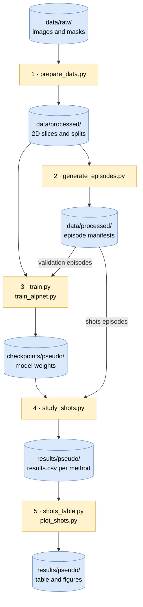

# Self-Supervised Meta-Learning from Sparse Labels for Few-Shot Medical Image Segmentation


Official implementation of **"Self-Supervised Meta-Learning from Sparse Labels for Few-Shot Medical
Image Segmentation"** — Danilo F. Vieira, José Roberto Martins-Costa, Daniel L. Fernandes,
Hugo N. Oliveira and Marcos H. F. Ribeiro (Universidade Federal de Viçosa).

**Paper:** *link to be added* <!-- TODO(author): add paper URL (and update the Paper badge) -->

Meta-learners are trained on superpixel pseudo-labels, sparsified to imitate cheap annotations, and then
adapted to unseen structures and modalities from *k* sparsely annotated support images.


| Method | Support masks at test time | Reference code |
|---|---|---|
| MAML / MetaSGD | sparse | [learn2learn](https://github.com/learnables/learn2learn) |
| PANet | sparse | [kaixin96/PANet](https://github.com/kaixin96/PANet) |
| R2D2 | sparse | [bertinetto/r2d2](https://github.com/bertinetto/r2d2) |
| ALPNet (baseline) | dense | [SSL-ALPNet](https://github.com/cheng-01037/Self-supervised-Fewshot-Medical-Image-Segmentation) |

## Installation

Tested on Ubuntu 24.04, Python 3.10, PyTorch 2.5.1 (CUDA 12.1) and a 6 GB GPU.

```bash
git clone https://github.com/danilo1917/SIBGRAPI2026-ssl-sparse-fss.git
cd SIBGRAPI2026-ssl-sparse-fss
python3.10 -m venv env && source env/bin/activate
pip install -r requirements.txt
pip install --no-deps learn2learn==0.2.0
```

## Data

The datasets are not included. Place each one under `data/raw/train/` (meta-training) or `data/raw/test/`
(evaluation):

```
data/raw/{train,test}/<dataset_name>/
├── imagesTr/   .nii.gz volumes or .png images
└── labelsTr/   one mask per image
```

- **NIfTI:** images and masks are paired by sorted file name; foreground is any label `> 0`.
- **PNG:** images and masks are paired by file name; foreground is any pixel `> 127`. Name slices of 3D
  scans `<volume>_<slice>.png` so that the train/validation split is done per volume.

Loading and preprocessing are in [`sslfss/data/loader.py`](sslfss/data/loader.py) and
[`scripts/prepare_data.py`](scripts/prepare_data.py); paths and parameters are in [`config.py`](config.py).

Datasets used in the paper (some were converted to the format above):

| Dataset | Role | Modality | Source | Citation |
|---|---|---|---|---|
| BraTS 2020 | train | MRI | [CBICA](https://www.med.upenn.edu/cbica/brats2020/data.html) | Menze et al. 2015; Bakas et al. 2017, 2018 |
| CHAOS (CT) | train | CT | [Zenodo](https://zenodo.org/records/3431873) | Kavur et al. 2021 |
| HC Pediatric Cerebellum | train | MRI | private | — |
| LiTS | train | CT | [CodaLab](https://competitions.codalab.org/competitions/17094) | Bilic et al. 2023 |
| MIAS | train | mammography | [Apollo, University of Cambridge](https://www.repository.cam.ac.uk/items/b6a97f0c-3b9b-40ad-8f18-3d121eef1459) | Suckling et al. 2015 |
| BTCV | train | CT | [Synapse](https://www.synapse.org/Synapse:syn3193805) | Landman et al. 2015 |
| JSRT | test | chest X-ray | [AJR](https://ajronline.org/doi/full/10.2214/ajr.174.1.1740071) | Shiraishi et al. 2000 |
| Panoramic Dental X-rays | test | panoramic X-ray | [PMC](https://pmc.ncbi.nlm.nih.gov/articles/PMC4652330/) | Abdi et al. 2015 |

## Usage

All commands run from the repository root.



```bash
# 1. Slice, resize and split the datasets into data/processed/
python scripts/prepare_data.py

# 2. Sample the fixed evaluation and validation episodes
python scripts/generate_episodes.py --seed 42 --n_trials 5 --k_eval 5 --k_max 10

# 3. Train (checkpoints/pseudo/)
for M in maml panet r2d2; do python scripts/train.py --method "$M"; done
python scripts/train_alpnet.py

# 4. Evaluate for k = 1..10 support images (results/pseudo/<method>/shots/)
for M in maml panet r2d2 alpnet; do
  python scripts/study_shots.py --method "$M" \
    --episodes data/processed/episodes_shots_s42_k10_t5.npz --k_values 1 2 3 5 7 10
done

# 5. Paper table and figures (results/pseudo/tables/, results/pseudo/figures/)
python scripts/shots_table.py
python scripts/plot_shots.py
```

Where to look in the code:

| Component | File |
|---|---|
| Superpixel pseudo-labels | [`sslfss/data/propose_msk.py`](sslfss/data/propose_msk.py) |
| Sparsification (points, grid, scribbles, contours) | [`sslfss/data/sparsify.py`](sslfss/data/sparsify.py) |
| Training episodes | [`sslfss/data/dataset.py`](sslfss/data/dataset.py) |
| Loss (masked BCE + Dice) | [`sslfss/losses.py`](sslfss/losses.py) |
| Methods and their hyperparameters | [`sslfss/methods/`](sslfss/methods/) |
| Query-level mean and 99 % confidence interval | [`sslfss/stats.py`](sslfss/stats.py) |

`generate_episodes.py` does not overwrite existing manifests; delete all `data/processed/episodes_*.npz`
to generate new ones.

### Adding a meta-learner

Every method implements `FewShotMethod` in [`sslfss/methods/base.py`](sslfss/methods/base.py).

| Needed for | Methods |
|---|---|
| Evaluation | `name`, `load_model`, `predict` |
| Training with `train.py` | `run_name`, `batch_size`, `build_model`, `optimizer_step`, `scheduler_step`, `val_episode`, `checkpoint_state` |

`predict` receives `(H, W)` images in [0, 1] and support masks in {-1, 0, 1} (unlabelled, background,
foreground), and returns a binary `(H, W)` mask. Signatures are in `base.py`.

To register it:

1. add it to [`sslfss/methods/factory.py`](sslfss/methods/factory.py);
2. add its name to the `--method` choices in [`scripts/train.py`](scripts/train.py) and [`scripts/study_shots.py`](scripts/study_shots.py);
3. add it to `METHODS` and the label/style dictionaries in [`scripts/shots_table.py`](scripts/shots_table.py) and [`scripts/plot_shots.py`](scripts/plot_shots.py).

[`sslfss/methods/r2d2_method.py`](sslfss/methods/r2d2_method.py) is a compact example.

## Results

Mean Dice per query image (mixed sparsification, 5 trials).

| JSRT | k=1 | k=2 | k=3 | k=5 | k=7 | k=10 |
|---|---|---|---|---|---|---|
| MAML / MetaSGD | 0.570 | 0.655 | 0.691 | 0.731 | 0.751 | 0.768 |
| PANet | 0.501 | 0.534 | 0.550 | 0.571 | 0.583 | 0.597 |
| R2D2 | 0.652 | 0.735 | 0.777 | 0.822 | 0.846 | 0.865 |
| ALPNet *(dense supports)* | 0.757 | 0.795 | 0.808 | 0.819 | 0.824 | 0.827 |

| Panoramic | k=1 | k=2 | k=3 | k=5 | k=7 | k=10 |
|---|---|---|---|---|---|---|
| MAML / MetaSGD | 0.518 | 0.568 | 0.602 | 0.640 | 0.665 | 0.687 |
| PANet | 0.609 | 0.637 | 0.658 | 0.681 | 0.700 | 0.716 |
| R2D2 | 0.634 | 0.710 | 0.744 | 0.773 | 0.792 | 0.805 |
| ALPNet *(dense supports)* | 0.732 | 0.770 | 0.790 | 0.804 | 0.811 | 0.817 |

| | |
|:---:|:---:|
|  |  |

## Acknowledgements

ALPNet code in [`sslfss/models/alpnet/`](sslfss/models/alpnet/) and `sslfss/data/alpnet_*.py` is adapted from
[SSL-ALPNet](https://github.com/cheng-01037/Self-supervised-Fewshot-Medical-Image-Segmentation) (MIT).
PANet and R2D2 follow their reference implementations; MAML uses [learn2learn](https://github.com/learnables/learn2learn)
and the [MONAI](https://github.com/Project-MONAI/MONAI) U-Net. The sparse annotation protocol follows
[Oliveira et al. 2024](https://github.com/hugo-oliveira/fsws_metalearning) and [WeaSeL](https://github.com/pedrohtg/weasel).


## Citation

```bibtex
@inproceedings{vieira2026selfsupervised,
  title     = {Self-Supervised Meta-Learning from Sparse Labels for Few-Shot Medical Image Segmentation},
  author    = {Vieira, Danilo F. and Martins-Costa, Jos{\'e} Roberto and Fernandes, Daniel L. and
               Oliveira, Hugo N. and Ribeiro, Marcos H. F.},
  booktitle = {Conference on Graphics, Patterns and Images (SIBGRAPI)},
  year      = {2026}
}
```
<!-- TODO(author): complete with publisher, pages and DOI after publication -->

<details>
<summary><b>Methods and libraries</b></summary>

```bibtex
@inproceedings{finn2017maml,
  title     = {Model-Agnostic Meta-Learning for Fast Adaptation of Deep Networks},
  author    = {Finn, Chelsea and Abbeel, Pieter and Levine, Sergey},
  booktitle = {International Conference on Machine Learning (ICML)},
  pages     = {1126--1135},
  year      = {2017}
}

@article{li2017metasgd,
  title   = {Meta-SGD: Learning to Learn Quickly for Few-Shot Learning},
  author  = {Li, Z. and Zhou, F. and Chen, F. and Li, H.},
  journal = {arXiv preprint arXiv:1707.09835},
  year    = {2017}
}

@inproceedings{wang2019panet,
  title     = {PANet: Few-Shot Image Semantic Segmentation With Prototype Alignment},
  author    = {Wang, Kaixin and Liew, Jun Hao and Zou, Yingtian and Zhou, Daquan and Feng, Jiashi},
  booktitle = {IEEE International Conference on Computer Vision (ICCV)},
  pages     = {9197--9206},
  year      = {2019}
}

@inproceedings{bertinetto2019r2d2,
  title     = {Meta-learning with differentiable closed-form solvers},
  author    = {Bertinetto, Luca and Henriques, Jo{\~a}o F. and Torr, Philip H. S. and Vedaldi, Andrea},
  booktitle = {International Conference on Learning Representations (ICLR)},
  year      = {2019}
}

@inproceedings{ouyang2020ssl,
  title     = {Self-Supervision with Superpixels: Training Few-shot Medical Image Segmentation without Annotation},
  author    = {Ouyang, Cheng and Biffi, Carlo and Chen, Chen and Kart, Turkay and Qiu, Huaqi and Rueckert, Daniel},
  booktitle = {European Conference on Computer Vision (ECCV)},
  pages     = {762--780},
  year      = {2020}
}

@article{oliveira2024meta,
  title   = {Meta-learners for few-shot weakly-supervised medical image segmentation},
  author  = {Oliveira, Hugo and Gama, Pedro H. T. and Bloch, Isabelle and Cesar Jr., Roberto M.},
  journal = {Pattern Recognition},
  volume  = {153},
  pages   = {110471},
  year    = {2024}
}

@article{gama2022weasel,
  title   = {Weakly Supervised Few-Shot Segmentation Via Meta-Learning},
  author  = {Gama, Pedro Henrique Targino and Oliveira, Hugo Neves and Marcato, Jose and Dos Santos, Jefersson},
  journal = {IEEE Transactions on Multimedia},
  volume  = {25},
  pages   = {1784--1797},
  year    = {2022}
}

@article{arnold2020learn2learn,
  title   = {learn2learn: A Library for Meta-Learning Research},
  author  = {Arnold, S{\'e}bastien M. R. and Mahajan, Praateek and Datta, Debajyoti and Bunner, Ian and Zarkias, Konstantinos Saitas},
  journal = {arXiv preprint arXiv:2008.12284},
  year    = {2020}
}

@article{cardoso2022monai,
  title   = {MONAI: An open-source framework for deep learning in healthcare},
  author  = {Cardoso, M. Jorge and others},
  journal = {arXiv preprint arXiv:2211.02701},
  year    = {2022}
}
```

</details>

<details>
<summary><b>Datasets</b></summary>

```bibtex
@article{menze2015brats,
  title   = {The Multimodal Brain Tumor Image Segmentation Benchmark (BRATS)},
  author  = {Menze, Bjoern H. and others},
  journal = {IEEE Transactions on Medical Imaging},
  volume  = {34}, number = {10}, pages = {1993--2024},
  year    = {2015},
  doi     = {10.1109/TMI.2014.2377694}
}

@article{bakas2017advancing,
  title   = {Advancing The Cancer Genome Atlas glioma MRI collections with expert segmentation labels and radiomic features},
  author  = {Bakas, Spyridon and others},
  journal = {Scientific Data},
  volume  = {4}, pages = {170117},
  year    = {2017},
  doi     = {10.1038/sdata.2017.117}
}

@article{bakas2018identifying,
  title   = {Identifying the Best Machine Learning Algorithms for Brain Tumor Segmentation, Progression
             Assessment, and Overall Survival Prediction in the BRATS Challenge},
  author  = {Bakas, Spyridon and others},
  journal = {arXiv preprint arXiv:1811.02629},
  year    = {2018}
}

@article{kavur2021chaos,
  title   = {CHAOS Challenge -- combined (CT-MR) healthy abdominal organ segmentation},
  author  = {Kavur, A. Emre and Gezer, N. Sinem and Bar{\i}{\c{s}}, Mustafa and others},
  journal = {Medical Image Analysis},
  volume  = {69}, pages = {101950},
  year    = {2021},
  doi     = {10.1016/j.media.2020.101950}
}

@article{bilic2023lits,
  title   = {The Liver Tumor Segmentation Benchmark (LiTS)},
  author  = {Bilic, Patrick and others},
  journal = {Medical Image Analysis},
  volume  = {84}, pages = {102680},
  year    = {2023},
  doi     = {10.1016/j.media.2022.102680}
}

@misc{suckling2015mias,
  title     = {Mammographic Image Analysis Society (MIAS) database v1.21},
  author    = {Suckling, J. and Parker, J. and Dance, D. and Astley, S. and Hutt, I. and others},
  publisher = {Apollo -- University of Cambridge Repository},
  year      = {2015},
  doi       = {10.17863/CAM.105113}
}

@inproceedings{landman2015btcv,
  title     = {MICCAI Multi-Atlas Labeling Beyond the Cranial Vault -- Workshop and Challenge},
  author    = {Landman, Bennett and others},
  booktitle = {MICCAI Multi-Atlas Labeling Beyond the Cranial Vault Workshop and Challenge},
  year      = {2015}
}

@article{shiraishi2000jsrt,
  title   = {Development of a digital image database for chest radiographs with and without a lung nodule:
             receiver operating characteristic analysis of radiologists' detection of pulmonary nodules},
  author  = {Shiraishi, Junji and others},
  journal = {American Journal of Roentgenology},
  volume  = {174}, number = {1}, pages = {71--74},
  year    = {2000}
}

@article{abdi2015panoramic,
  title   = {Automatic segmentation of mandible in panoramic x-ray},
  author  = {Abdi, Amir Hossein and Kasaei, Shohreh and Mehdizadeh, Mojdeh},
  journal = {Journal of Medical Imaging},
  volume  = {2}, number = {4}, pages = {044003},
  year    = {2015},
  doi     = {10.1117/1.JMI.2.4.044003}
}
```

</details>

## License

Released under the [MIT License](LICENSE). Adapted third-party code keeps its original license, and each
dataset remains subject to its own terms of use.
